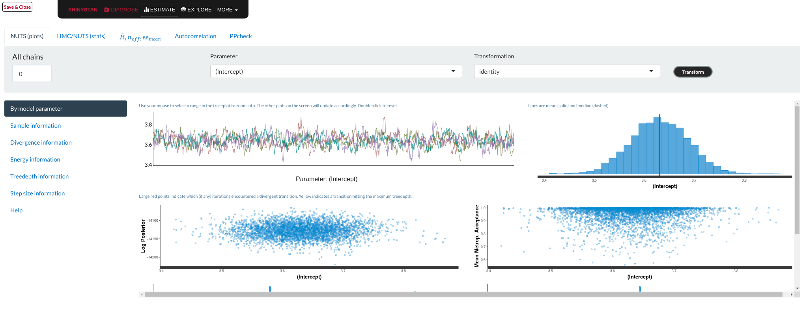

```{r setup, include=FALSE}
knitr::opts_chunk$set(echo = TRUE, comment=NA)
```
```{r, echo=F, results='hide', message=F, warning=F}
library(rstanarm)
library(tidyverse)
load("data/mod_base_default_prior.rda")
load("data/mod_base.rda")
load("data/mod_simple.rda")
load("data/df_m.rda")

df.model <- df.m %>% 
  select(gesamtwohnflaeche,  gesamt_kaufpreis, plz) %>%
  rename(area = gesamtwohnflaeche, price = gesamt_kaufpreis) %>%
  mutate(area.s = as.numeric(scale(area, scale=T)),
         price.s = price / 100000) %>%
  as.tibble

mod <- mod_base_default_prior

standardize <- function(x) {
  (x - mean(df.m$gesamtwohnflaeche)) / sd(df.m$gesamtwohnflaeche)
}

unstandardize <- function(x) {
  x * sd(df.m$gesamtwohnflaeche) + mean(df.m$gesamtwohnflaeche)
}

umweltzone <- read_csv("data/umweltzone_plz_zuordnung.csv", col_types = "cc") %>%
  rename(umweltzone = `Umweltzone Berlin`,
         plz = Postleitzahl) %>%
  filter(umweltzone != "außerhalb")
```

# What does Europace do?
--
```{r, echo=FALSE}

```
---

## Estimating House Prices
What are good predictors?
--

- Size

--
.pull-right[
```{r, echo=F}

```
]
--

- Location, location, location

---
## How to include ZIP codes in your model?
--


- Encoding, e.g. One-Hot-Encoding

--

- Categorical embedding

--

- Omit

--

- One model per ZIP code

--

- **Hierarchical model**

---
## Hierarchical Model

In short:

A compromise between **one model per ZIP code** (no pooling) and **ignoring ZIP code information** (complete pooling).

A hierarchical model does **partial pooling**
---

## The model


.large[
$$\begin{align*}
\text{Price} &\sim \text{Normal}(\mu, \sigma) \\
\\
\\
\mu &= \alpha_{[ZIP]} + \beta_{[ZIP]} \text{area} 
\end{align*}$$
]
---
## How to compute it
--

> RStanArm allows users to specify models via the customary R commands, where models are specified with formula syntax.

--
```{r, eval=F}
library(rstanarm)
options(mc.cores = parallel::detectCores())

mod <-   stan_lmer( price.s ~  area + (1 + area | plz)  ,
          data=df.model)
```
--
A simpler model for comparison:
```{r, eval=F}
mod_simple <- stan_glm( price.s ~  area   ,
          data=df.model)
```

`price.s` is the price in 100,000s.
---
## What about priors?

RStanArm uses by default **weakly regularized** priors
--
```{r}
prior_summary(mod)
```
---
## What about priors?

### Note on centering
RStanArm automatically centers predictor variables internally but reports estimates corresponding to a parameterization without centered predictors. 

To avoid auto-centering, you can omit the intercept and add it manually as a column of ones as predictor:
```{r, eval=F}
mod_uncentered <- df.model %>%
  mutate(intc = 1) %>%
    stan_lmer( price ~ area + intc + (intc + area | plz) -1 ,
               data=.)
```
The prior for the intercept is then defined by the priors for the predictor.
---
## What about priors?

We can of course also fit our own priors:
```{r, echo=F}
mod <- mod_base
```
```{r, eval=F}
mod <-   stan_lmer( price.s ~  area.s + 
                             (1 + area.s | plz)  ,
                data=df.model,
                prior_intercept=normal(location=3, scale=3, 
                                      autoscale = FALSE),
                prior=normal(location=0, scale=2.5, 
                                      autoscale=FALSE)) 
```

---


## Assessing convergence

```{r, eval=F}
launch_shinystan(mod)
```
--
```{r, echo=FALSE}

```

---

## Assessing convergence
The package `bayesplot` can be used to get the same plots as in shinystan and more:
.pull-left[
```{r, echo=F}
in_ring <- paste("\\(Intercept\\) plz:", 
                      umweltzone$plz, collapse="|", sep="")
t <- "Rhat for intercept parameter"
st <- "Onky PLZ inside the S-Bahn Ring"
```

```{r, plot-label-rhat,  fig.show="hide", warning=F, message=F, fig.height=6, fig.width=5}
library(bayesplot)
rhat(mod, 
     regex_pars=in_ring) %>% 
  mcmc_rhat() + 
  labs(title=t,
      subtitle=st)
```
]
.pull-right[
`)
]
---

## Model comparison
--
```{r, eval=F}
library(loo)
l_mod <- loo(mod)
l_simple <- loo(mod_simple)

compare_models(l_mod, l_simple)
```
```{r, echo=F}
load("data/loo_base.rda")
load("data/loo_simple.rda")
compare_models(l_base, l_simple)
```

---

## Analyzing the results
Extract fitted draws
```{r, message=F, warning=F, fig.height=8}
mitte <- c("10117", "10119", "10178", "10179")
library(tidybayes)
library(modelr)
df.model %>%
  filter(plz %in% mitte) %>%
  group_by(plz) %>%
  data_grid(area.s = seq_range(area.s, n=100)) %>% #<<
  add_fitted_draws(mod, n=50) %>% #<<
  head()
```
---

## Analyzing the results
```{r, plot-mitte, fig.height=7, fig.width=7, echo=F, message=F, warning=F, fig.show="hide"}
mitte <- c("10117", "10119", "10178", "10179")
library(tidybayes)
library(modelr)
df.model %>%
  filter(plz %in% mitte) %>%
  group_by(plz) %>%
  data_grid(area.s = seq_range(area.s, n=100)) %>%
  add_fitted_draws(mod, n=50) %>%
  ggplot(aes(x=area.s, y=price.s, color=plz))+
  geom_line(aes(y=.value, group=.draw), 
            alpha=.1, show.legend=F) +
  geom_point(data=df.model %>% filter(plz %in% mitte), 
             col="black", size=0.5) +
  facet_wrap(~plz) +
  scale_x_continuous(breaks = standardize(seq(50, 300, by=50) ),
                     labels= seq(50, 300, by=50), 
                     limits = c(-2, 4)) +
  scale_y_continuous(labels=function(x) x*100) +
  labs(y="Price", x="Area", main="Prices in Mitte") +
  theme(panel.spacing=unit(3, "lines"))
```
.center[ 
`)
]

---
## Analyzing the results
Extract posterior predictions
```{r}
df.model %>%
  filter(plz %in% mitte) %>%
  group_by(plz) %>%
  data_grid(area.s = seq_range(area.s, n=100) ) %>%
  add_predicted_draws(mod, n=50) %>% #<<
  head()
```
---
## Analyzing the results
```{r, plot-mitte-post, fig.show="hide", fig.height=7, fig.width=7, echo=F}
df.model %>%
  filter(plz %in% mitte) %>%
  group_by(plz) %>%
  data_grid(area.s = seq_range(area.s, n=100) ) %>%
  add_predicted_draws(mod, n=50) %>%
  ggplot(aes(x=area.s, y=price.s, fill=plz, col=plz))+
  stat_lineribbon(aes(y=.prediction), .width= c(.95, .80, .50), alpha=.25, 
                  show.legend=FALSE) +
  geom_point(data=df.model %>% filter(plz %in% mitte), 
             col="black", size=0.5, show.legend = FALSE) +
  facet_wrap(~plz) +
  scale_x_continuous(breaks = standardize(seq(50, 300, by=50) ),
                     labels= seq(50, 300, by=50), 
                     limits = c(-2, 4)) +
  scale_y_continuous(labels=function(x) x*100) +
  scale_fill_brewer(palette = "Set2") +
  scale_color_brewer(palette = "Dark2") +
  labs(y="Price", x="Area", main="Prices in Mitte") +
  theme(panel.spacing=unit(3, "lines"))
```
.center[ 
`)
]

---

## Predicting
We can predict using the RstanArm function `posterior_predict()` 
```{r, post-hist, fig.show="hide", fig.height=4}
nd <- data.frame(area.s=standardize(101), plz="10407") 
post <- posterior_predict(mod, newdata=nd) 
hist(post, main="Posterior", xlab="Price in 100,000s")
```
.center[ 
`)
]
---

## Predicting
Or using `tidybayes` we can get predictions in a tidy format:
```{r, echo=-1}
set.seed(2407)
post <- data.frame() %>%
  data_grid(area.s=standardize(101),
            plz = "10407") %>%
  add_predicted_draws(mod) 
```
```{r, post-dot, fig.show="hide", echo=F, fig.height=4}
post %>%
  do(data_frame(.prediction = quantile(.$.prediction, ppoints(100)))) %>%
  ggplot(aes(x= .prediction)) +
  geom_dotplot(binwidth = .3, fill="gray") +
  scale_y_continuous(breaks=NULL) +
  xlab("Price in 100,000s") 
```
.center[ 
`)
]
---
## What is the probability
We can use the posterior to answer questions such as

>  "What is the probability that a house in 10407 (Prenzlauer Berg) of 101sqm has a price less than 300,000€?"

```{r}
mean( post$.prediction < 3 )
```
--
```{r, post-dot-prob, fig.show="hide", echo=F, message=F, warning=F, fig.height=4}
set.seed(2407)
quants <- data.frame() %>%
  data_grid(area.s=standardize(101),
            plz = "10407") %>%
  add_predicted_draws(mod) %>%
  do(data_frame( .value = quantile(.$.prediction, ppoints(100)))) %>%
  mutate(cheap = .value < 3)

quants %>% 
  ggplot(aes(x= .value, fill=cheap)) +
  geom_dotplot(binwidth=.3, show.legend=FALSE, binpositions = "all") +
  scale_fill_manual(values = c("gray", "light blue"))+
  scale_y_continuous(breaks = NULL) +
  scale_x_continuous(breaks = c(2,3,4,6,8)) +
  xlab("Prices in 100,000s")
```
.center[ 
`)
]

---
## Pretty Visualizations
```{r, echo=FALSE, results='hide', message=F, warning=F}
library(rgdal)           # for working with shapefiles
library(RColorBrewer)    # nice colors
# Shapefiles downloaded from here: 
# https://www.suche-postleitzahl.org/downloads
bezirke.spdf <- readOGR('data/plz-gebiete.shp/plz-gebiete.shp')
bezirke.spdf@data$id = rownames(bezirke.spdf@data)
bezirke.spdf@data$area <- sapply(bezirke.spdf@polygons, slot, "area")
bezirke.df <- fortify(bezirke.spdf, region="id") %>%
  inner_join(bezirke.spdf@data, by='id') %>%
  select(-note)
plz.names <- read_csv("data/zuordnung_plz_ort.csv") %>% distinct(plz, .keep_all = T)
bezirke.df <- bezirke.df %>% 
  inner_join(plz.names, by='plz')

berlin.df <- bezirke.df %>%
  filter(bundesland == "Berlin") %>%
  left_join(umweltzone, by="plz")


# Mittelpunkte der PLZ Bezirke für das spätere Label
centroids <- aggregate(cbind(long, lat) ~ plz, data=berlin.df, FUN=mean) %>%
  filter(plz %in%  c("10179", "10407"))


berlin.plz.map <- ggplot(data=berlin.df,
       aes(x=long, y=lat, group=group)) +
  geom_polygon(fill=NA, 
               alpha=0.5,
               colour='black',
               size=0.3, show.legend = F) +
  coord_map(projection='mercator') + 
  labs(title='Berlin PLZ Shapes',
       x="",
       y="") + theme(axis.text = element_blank(),
                                           axis.line = element_blank(),
                                           axis.ticks = element_blank())

ring.plz.map <- ggplot(data=berlin.df %>% filter(!is.na(umweltzone)),
       aes(x=long, y=lat, group=group)) +
  geom_polygon(fill=NA, 
               alpha=0.5,
               colour='black',
               size=0.3, show.legend = F) +
  coord_map(projection='mercator') + 
  labs(title='Berlin PLZ Shapes',
       x="",
       y="") + theme(axis.text = element_blank(),
                                           axis.line = element_blank(),
                                           axis.ticks = element_blank())


cfs <- coef(mod)$plz
cfs$intercept <- cfs$`(Intercept)`
cfs$intercept.bin <- cut(cfs$intercept,
                         c(0, 2.5, 3, 3.5, 4, 4.5, 5, 10),
                         labels=c("less than 250", "250-300", "300-350", 
                                  "350-400", "400-450", "450-500", "more than 500"))

cfs$area.bin <- cut( ( cfs$area.s / sd(df.model$area))*100000,
                                  c(0, 2000, 2500, 3000, 3500, 4000, 4500, 5000, 6000, 10000),
                                  labels=c("less than 2000", "2000-2500", "2500-3000", 
                                           "3000-3500", "3500-4000", "4000-4500", "4500-5000", "5000-6000", "more than 6000"))

cfs$plz <- rownames(cfs)

berlin.df.cf <- berlin.df %>%
  left_join(cfs, by='plz') 

ring.df <- berlin.df.cf %>%
  filter(!is.na(umweltzone))

plot_intercept <- berlin.plz.map + 
  geom_polygon(data=berlin.df.cf %>% filter(!is.na(intercept.bin)),
               aes(x=long, y=lat,
                   group=group, fill=intercept.bin),
               color="black", size=0.3,
               show.legend = T) +
  scale_color_brewer(type="seq", palette="YlOrRd", aesthetics = "fill",
                     name="Intercept\nin 000s", drop=F) +
  labs(title='Intercept', subtitle='Price Estimate for an Average House (104sqm)') 

ring_intercept <- ring.plz.map + 
  geom_polygon(data=ring.df %>% filter(!is.na(intercept.bin)),
               aes(x=long, y=lat,
                   group=group, fill=intercept.bin),
               color="black", size=0.3,
               show.legend = T) +
  scale_color_brewer(type="seq", palette="YlOrRd", aesthetics = "fill",
                     name="Intercept\nin 000s", drop=F) +
  labs(title='Intercept (inside the Ring)', subtitle='Price Estimate for an Average House (104sqm)') 

plot_slope<- berlin.plz.map + 
  geom_polygon(data=berlin.df.cf %>% filter(!is.na(area.bin)),
               aes(x=long, y=lat,
                   group=group, fill=area.bin),  
               color="black", size=0.3,
                show.legend = T) +
   scale_color_brewer(type="seq", palette="YlOrRd", aesthetics = "fill",
                     name="Slope\nin € per sqm", drop=F) +
  labs(title='Slope') 

ring_slope<- ring.plz.map + 
  geom_polygon(data=ring.df %>% filter(!is.na(area.bin)),
               aes(x=long, y=lat,
                   group=group, fill=area.bin),  
               color="black", size=0.3,
                show.legend = T) +
    scale_color_brewer(type="seq", palette="YlOrRd", aesthetics = "fill",
                     name="Slope\nin € per sqm", drop=F) +
  labs(title='Slope (inside the Ring)') 
```
```{r, plot-intercept, fig.height=6, fig.width=10, fig.show="hide", echo=F, dpi=300}
plot_intercept
```
.center[ 
`)
]
---
## Pretty Visualizations
```{r, ring-intercept, fig.show="hide", fig.height=6, fig.width=8, echo=F, dpi=280}
ring_intercept +
  geom_text(data=centroids, mapping=aes(x=long, y=lat, label=plz, group=plz), 
            col='black', size=3) 
```
.center[ 
`)
]
---
## Pretty Visualizations
```{r, plot-slope, fig.show="hide", echo=F, fig.height=6, fig.width=8, dpi=300}
plot_slope
```
.center[ 
`)
]
---
## Pretty Visualizations
```{r, ring-slope, fig.show="hide", echo=F, fig.height=6, fig.width=8, dpi=280}
ring_slope +
  geom_text(data=centroids, mapping=aes(x=long, y=lat, label=plz, group=plz), 
            col='black', size=3) 
```
.center[ 
`)
]
---

## Things to improve

--
- Many outliers in the data

--

  - Price for large houses difficult to predict
  
--

- Important predictors still missing

--

  - Object type (e.g. house or flat)
  
--

  - Time
  
--

- No information about similarity of neighborhoods included

  - Spatial modelling, e.g. ICAR model

---
## Questions?

Slides and Code can be found []()


Twitter: @corrieaar

**Thank you!**